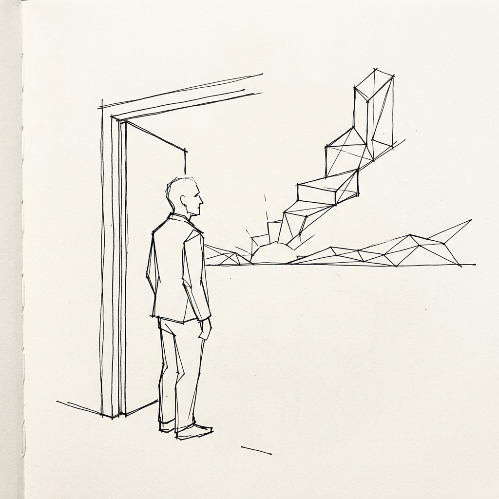
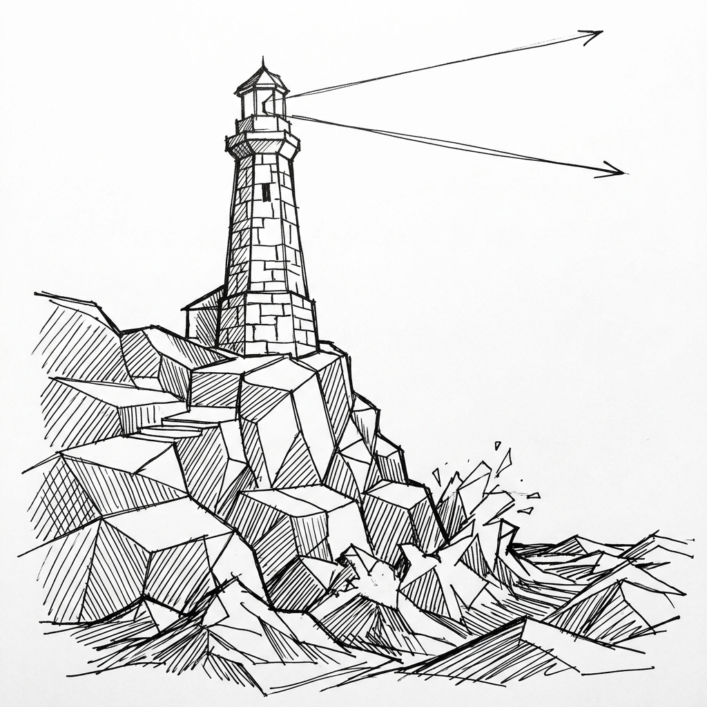
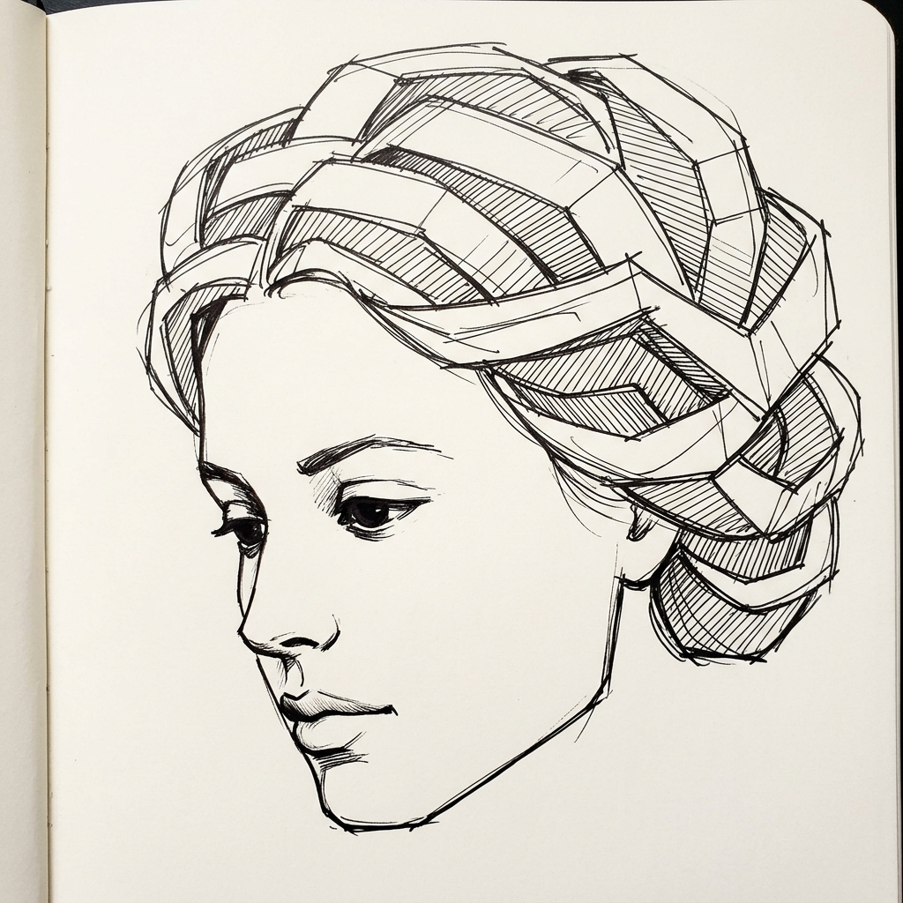
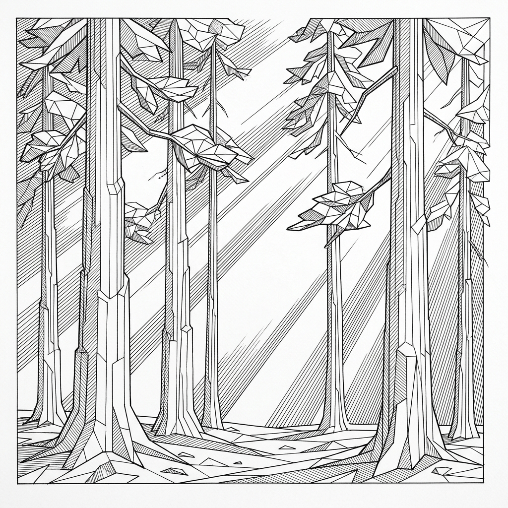
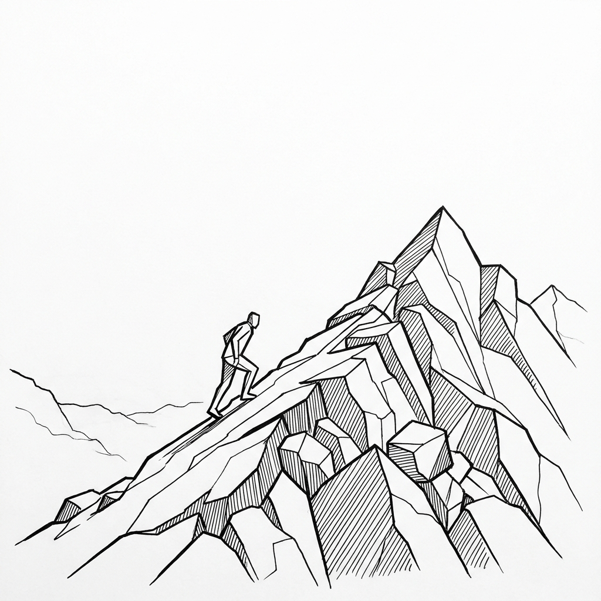

# Words in the Negative Space
### 5 Poems in Ink & Resilience

*Published by 864zeros Publishing House · Version 2.0.0 (2026-10-01)*  
*Visual Style: `jeff_geometric style` (Minimalist Pen & Ink on Paper)*  
*Visual Directive: All-New Plates Generated Directly from Poem Instructions & Descriptions*  
*License: CC-BY-4.0 / 864zeros Original Content*

---

## Introduction & Practice Philosophy

What we leave unsaid—and unlined—often carries more power than what we fill in.

In draftsmanship, **Gestalt closure** is the deliberate art of subtraction: leaving lines out so the viewer's visual cortex completes the form across vast, untouched negative space. In poetry and human resilience, peace functions the exact same way. When life feels overwhelming, our reflex is additive: we clutter our minds with worry, obsess over outcomes we cannot control, and over-draw our anxieties.

This practice eBook combines two disciplines:
1. **Original 864zeros Poetic Verse:** Distilling core human encounters—awakening, steadfastness, patient grace, sacred solitude, and mountain courage.
2. **`jeff_geometric` Fine-Art Draftsmanship:** Architectural, stepped polygonal planes, disciplined directional parallel diagonal hatching, and vast unshaded white paper.

For every poem in this collection, **the poem itself serves as the direct prompt instruction and visual description** for an all-new fine-art plate rendered in the calibrated `jeff_geometric style`.


---

## Table of Contents

1. [Poem 1: The Architect of Dawn](#poem-1-the-architect-of-dawn)
2. [Poem 2: The Lighthouse at the World's Edge](#poem-2-the-lighthouse-at-the-worlds-edge)
3. [Poem 3: The Woman of the Silver Loom](#poem-3-the-woman-of-the-silver-loom)
4. [Poem 4: The Silent Cathedral of Pine](#poem-4-the-silent-cathedral-of-pine)
5. [Poem 5: The Traveler and the Granite Pass](#poem-5-the-traveler-and-the-granite-pass)

---

## Poem 1: The Architect of Dawn

> **Theme:** Awakening & Clarity  
> **Accent Color:** `#B8860B` · **Art Plate:** `images/poem_01.jpg`

### The Written Verse

```text
Before the sun can break the seal of night,
An architect of silence draws the lines,
Lifting the dark with scaffolding of light,
Where morning's sharp and quiet prism shines.
No heavy shadows clutter on the floor,
Just naked dawn across an open door.
```

---

### Visual Art Plate



### Direct Prompt Instructions & Description

* **Prompt Instruction:**
  ```text
  jeff_geometric style, fine art pen and black ink drawing on pure stark white paper.
  Poem and visual description:
  "Before the sun can break the seal of night,
  An architect of silence draws the lines,
  Lifting the dark with scaffolding of light,
  Where morning's sharp and quiet prism shines.
  No heavy shadows clutter on the floor,
  Just naked dawn across an open door."
  Scene: A solitary architectural contemplative figure standing in quiet contemplation before an open threshold doorway, looking out upon a rising radiant dawn composed of stepped geometric light beams and faceted polygonal horizon planes.
  Technical style rules: Sharp calligraphic black ink contours, disciplined directional parallel diagonal hatching, stepped polygonal faceted planes, vast pure stark white negative space, Gestalt subtractive facial restraint with single-stroke suggestive facial features leaving the face pure untouched white paper, zero gray tones, zero muddy shading.
  ```
* **Visual Description:** A contemplative figure framed within a tall architectural doorway, looking out upon stepped geometric sunbeams that cut through the darkness like crystalline scaffolding, rendered with disciplined parallel diagonal hatching and vast white negative space.

---

### Cognitive & Philosophical Intent

Initiating mental clarity at the start of each day. Before emotional confusion and external noise claim your attention, deliberately construct your focus through quiet discipline and purpose.

---

### Guided Reflection & Journal

Before the demands of the world rush into your mind today, what is the single truthful principle you choose to scaffold your thoughts upon?

```text
[ Journal Entry — Poem 1 ]
__________________________________________________________________________________
__________________________________________________________________________________
__________________________________________________________________________________
```

---

### Actionable Micro-Practice

* **Today's Rule:** Begin tomorrow morning with 5 minutes of total silence before checking any screen or notification. Observe the dawn across your threshold.

---

## Poem 2: The Lighthouse at the World's Edge

> **Theme:** Steadfastness & Resilience  
> **Accent Color:** `#1976D2` · **Art Plate:** `images/poem_02.jpg`

### The Written Verse

```text
The ocean crashes on the granite bone,
A hundred tempests battering the height,
Yet steadfast stands the solitary stone,
Casting a needle of unbroken light.
Let all the waters heave and turn to foam;
The beacon marks the steady pathway home.
```

---

### Visual Art Plate



### Direct Prompt Instructions & Description

* **Prompt Instruction:**
  ```text
  jeff_geometric style, fine art pen and black ink drawing on pure stark white paper.
  Poem and visual description:
  "The ocean crashes on the granite bone,
  A hundred tempests battering the height,
  Yet steadfast stands the solitary stone,
  Casting a needle of unbroken light.
  Let all the waters heave and turn to foam;
  The beacon marks the steady pathway home."
  Scene: A towering angular stone lighthouse anchored atop a steep crystalline cliff constructed from stepped polygonal rock facets with disciplined parallel diagonal hatching, with turbulent geometric ocean waves breaking against the base, casting a sharp straight beam of light into vast stark white negative space sky.
  Technical style rules: Architectural stepped polygonal facets, crisp bold black ink contours, disciplined directional parallel diagonal hatching, pure stark white untouched paper background, zero gray wash, zero smudging, clean draftsmanship.
  ```
* **Visual Description:** A soaring angular stone lighthouse anchored atop stepped polygonal granite bedrock, sending an unbroken straight beam of light into pure stark white negative space while crystalline geometric waves shatter harmlessly against the stone base.

---

### Cognitive & Philosophical Intent

Unshakable core character amidst external turbulence. When social opinions or circumstances storm around you, your role is not to battle the ocean, but simply to remain anchored and shine unbroken light.

---

### Guided Reflection & Journal

What external turbulence or crisis is currently churning around you? How can you remain rooted like the stone beacon rather than tossing with the waves?

```text
[ Journal Entry — Poem 2 ]
__________________________________________________________________________________
__________________________________________________________________________________
__________________________________________________________________________________
```

---

### Actionable Micro-Practice

* **Today's Rule:** Identify one area of emotional drama you have been drawn into. Take one step backward and commit to offering calm, steady clarity rather than reactivity.

---

## Poem 3: The Woman of the Silver Loom

> **Theme:** Grace & Subtractive Beauty  
> **Accent Color:** `#8C4456` · **Art Plate:** `images/poem_03.jpg`

### The Written Verse

```text
Her fingers move among the quiet strands,
Weaving the ribboned fabric of the years,
With patient grace and unhurried hands,
Turning to thread our ancient hopes and fears.
Her gaze downcast, her spirit calm and deep,
Guarding the promises we long to keep.
```

---

### Visual Art Plate



### Direct Prompt Instructions & Description

* **Prompt Instruction:**
  ```text
  jeff_geometric style, fine art pen and black ink drawing on pure stark white paper.
  Poem and visual description:
  "Her fingers move among the quiet strands,
  Weaving the ribboned fabric of the years,
  With patient grace and unhurried hands,
  Turning to thread our ancient hopes and fears.
  Her gaze downcast, her spirit calm and deep,
  Guarding the promises we long to keep."
  Scene: A close-up fine art portrait of a serene young woman in profile or three-quarter view, her hair styled in cascading interlocking 3D geometric faceted ribbons with directional diagonal parallel hatching.
  Technical style rules: Gestalt subtractive facial restraint leaving cheek and forehead completely untouched stark white paper; single-stroke suggestive ink dash for nose; expressive downcast dark pool for eye; full upper lip with delicate pillowy curvature and subtle under-lip shadow; rigid straight-line jaw break and chiseled geometric chin; pure stark white negative space background; zero text, zero typography on image, zero words, zero quotes, zero under-eye bags, zero eyelid wrinkles, zero nasolabial folds, zero gray gradients.
  ```
* **Visual Description:** An exquisite minimalist fine-art ink portrait in profile. Stepped interlocking geometric ribbon planes flow through her hair with disciplined parallel hatching, contrasted by absolute Gestalt subtractive restraint across a pure stark white cheek and forehead, signature pillowy full upper lip, chiseled straight-line jaw, and soulful downcast eye.

---

### Cognitive & Philosophical Intent

The power of patience and quiet craftsmanship. True beauty and enduring character are woven strand by strand through unhurried discipline, letting unnecessary noise fall away into untouched negative space.

---

### Guided Reflection & Journal

Where in your life have you felt rushed or desperate to force an outcome? How would adopting unhurried, patient grace shift your perspective today?

```text
[ Journal Entry — Poem 3 ]
__________________________________________________________________________________
__________________________________________________________________________________
__________________________________________________________________________________
```

---

### Actionable Micro-Practice

* **Today's Rule:** Slow down your cadence in one routine activity today (walking, eating, listening). Treat it as a patient, woven discipline of grace.

---

## Poem 4: The Silent Cathedral of Pine

> **Theme:** Sanctuary & Stillness  
> **Accent Color:** `#2E6245` · **Art Plate:** `images/poem_04.jpg`

### The Written Verse

```text
No gilded roof, no organ in the nave,
Only the solemn pillars of the wood,
Where morning sun pours down a quiet wave,
And sorrow leaves what mercy understood.
The boughs reach up in geometric grace,
Holding the hush within a sacred space.
```

---

### Visual Art Plate



### Direct Prompt Instructions & Description

* **Prompt Instruction:**
  ```text
  jeff_geometric style, fine art pen and black ink drawing on pure stark white paper.
  Poem description to illustrate:
  "No gilded roof, no organ in the nave,
  Only the solemn pillars of the wood,
  Where morning sun pours down a quiet wave,
  And sorrow leaves what mercy understood.
  The boughs reach up in geometric grace,
  Holding the hush within a sacred space."
  Visual scene: A cathedral-like deep forest grove of ancient tall pine trees rendered with stepped polygonal trunks and faceted geometric boughs, with disciplined directional parallel diagonal hatching showing shafts of radiant morning light cutting through the forest canopy across pure stark white negative space.
  Technical style rules: Minimalist pen and black ink, disciplined directional parallel diagonal hatching, faceted architectural natural forms, crisp clean ink contours on pure white paper, zero text, zero typography on image, zero smudging, zero gray tones.
  ```
* **Visual Description:** A magnificent architectural grove of pine trees whose trunks rise as stepped polygonal colonnades. Disciplined parallel diagonal hatching forms radiant angled sun shafts breaking through the faceted boughs, turning natural negative space into a sacred cathedral.

---

### Cognitive & Philosophical Intent

Creating internal sanctuary. You do not need grand temples or external validation to experience profound peace; solitude, stillness, and honest reflection provide an unshakable cathedral within your own mind.

---

### Guided Reflection & Journal

What clutter, noise, or sorrow can you surrender today in exchange for the quiet stillness of your own internal sanctuary?

```text
[ Journal Entry — Poem 4 ]
__________________________________________________________________________________
__________________________________________________________________________________
__________________________________________________________________________________
```

---

### Actionable Micro-Practice

* **Today's Rule:** Take a 10-minute walk in nature or sit near living greenery today without headphones. Pay attention to the silence between the leaves.

---

## Poem 5: The Traveler and the Granite Pass

> **Theme:** Courage & Elevation  
> **Accent Color:** `#D84315` · **Art Plate:** `images/poem_05.jpg`

### The Written Verse

```text
Above the tree line where the air is thin,
The pilgrim walks the ridge of jagged stone,
Leaving the valley where the mist had been,
To meet the summit winds, untamed, alone.
Each upward step a victory over dread,
The open sky unfolding overhead.
```

---

### Visual Art Plate



### Direct Prompt Instructions & Description

* **Prompt Instruction:**
  ```text
  jeff_geometric style, fine art pen and black ink drawing on pure stark white paper.
  Poem description to illustrate:
  "Above the tree line where the air is thin,
  The pilgrim walks the ridge of jagged stone,
  Leaving the valley where the mist had been,
  To meet the summit winds, untamed, alone.
  Each upward step a victory over dread,
  The open sky unfolding overhead."
  Visual scene: A lone traveler ascending a knife-edge mountain ridge composed of stepped polygonal granite crags and faceted alpine boulders, leaning purposefully into the wind toward a sharp geometric mountain peak, framed against vast stark white negative space sky.
  Technical style rules: Bold calligraphic black ink contour silhouettes, disciplined directional parallel diagonal hatching on shadowed rock planes, minimalist Gestalt figure rendering with clean angular posture, pure untouched white paper background, zero text, zero typography on image, zero gray wash, zero muddy tones.
  ```
* **Visual Description:** A lone resolute traveler in clean angular silhouette climbing a razor-sharp alpine ridge of stepped polygonal granite crags. Bold directional parallel hatching sculpts the rock face while the summit winds open into boundless white negative space.

---

### Cognitive & Philosophical Intent

Transcending the misty lowlands of comfort and fear. Growth demands leaving the crowded valley behind and climbing into the thin, demanding air of personal responsibility and courage.

---

### Guided Reflection & Journal

What comfortable 'valley' have you been lingering in because climbing the rugged pass felt intimidating? What would one upward step look like today?

```text
[ Journal Entry — Poem 5 ]
__________________________________________________________________________________
__________________________________________________________________________________
__________________________________________________________________________________
```

---

### Actionable Micro-Practice

* **Today's Rule:** Tackle the single hardest task on your desk first thing today before opening email or social feeds. Meet the summit wind directly.

---

*Words in the Negative Space: 5 Poems in Ink & Resilience · 864zeros Media House · 2026*
