# Foundations of Resilience: 10 Essential Life Lessons
### Daily Practice Workbook — Scripture, Intent, Reflection & Visual Meditation
*Published by 864zeros Media & Content House · Version 2.0.0 (2026-09-02)*  
*Visual Style: Universal Humanizer + jeff_sketch Refinement (Two-Pass Visual-DAGR Pipeline)*

---

## Introduction & Practice Philosophy

The **Foundations of Resilience Practice Book** combines four distinct disciplines into a daily practice routine:

1. **Timeless Scripture:** Grounded in public-domain scripture (KJV and WEB) paired with clear, modern 2026 plain-language renderings.
2. **Extracted Intent:** Distilling theological passages into direct, actionable cognitive and behavioral principles.
3. **Visual-DAGR Humanizer Art (`jeff_sketch`):** Expressive minimalist fountain pen line art embodying authentic line economy. Hand-drawn calligraphic stroke dynamics, 75% interior reduction, 20% random line-weight accents, and vast stark white negative space.
4. **Superimposed Reflection & Action:** Pairing typography directly over art plates to create memorable mental anchors, backed by guided journaling and concrete micro-practices.

---

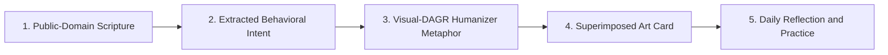

---

## Table of Contents
1. [Lesson 1: Speak Light into Your Chaos (Genesis 1:3)](#lesson-1-order-over-chaos)
2. [Lesson 2: Guard the Gates of Your Mind (Proverbs 4:23)](#lesson-2-guard-the-gates)
3. [Lesson 3: Surrender the Heavy Burden (Matthew 11:28)](#lesson-3-surrender-the-burden)
4. [Lesson 4: Walk Through the Storm, Not Around It (Isaiah 43:2)](#lesson-4-walk-through-the-waters)
5. [Lesson 5: Anchor in What Cannot Be Shaken (Psalm 46:1-2)](#lesson-5-anchor-in-the-unshakable)
6. [Lesson 6: Prune What Drains Life to Bear Real Fruit (John 15:2)](#lesson-6-prune-to-bear-fruit)
7. [Lesson 7: Win the Battle One Day at a Time (Matthew 6:34)](#lesson-7-win-today)
8. [Lesson 8: Let Forgiveness Untie Your Chains (Colossians 3:13)](#lesson-8-untie-the-chains)
9. [Lesson 9: Serve in Secret, Build in Quiet (Galatians 6:9)](#lesson-9-serve-in-quiet)
10. [Lesson 10: Run Your Race with Eyes Fixed Forward (Hebrews 12:1-2)](#lesson-10-run-with-endurance)

---

## Lesson 1: Speak Light into Your Chaos

> **Theme:** Creation & Mindset · **Reference:** Genesis 1:3

### Visual Plate & Superimposed Concept
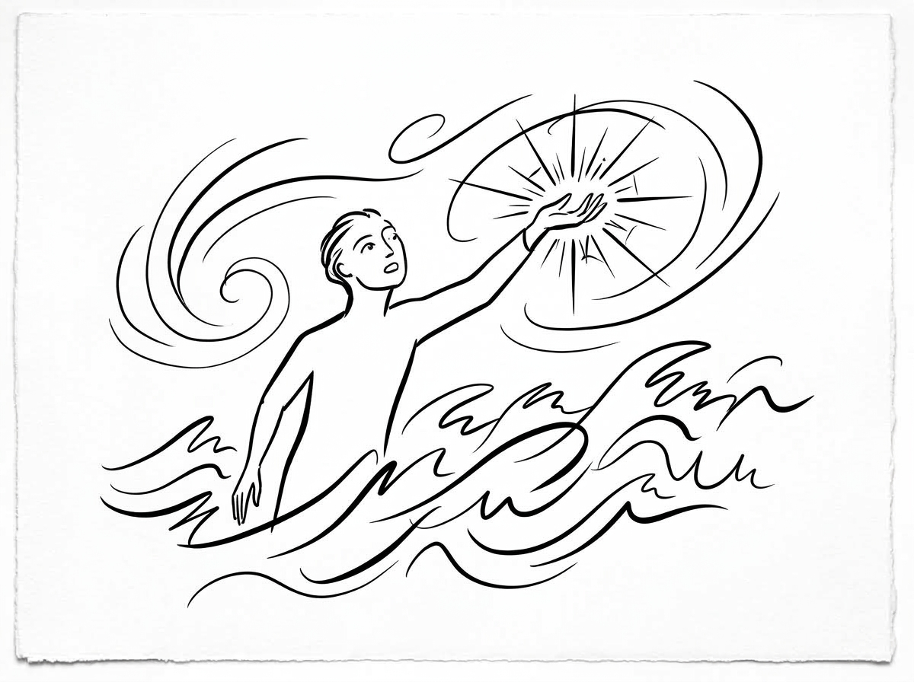

```text
┌──────────────────────────────────────────────────────────────────────────┐
│ [SUPERIMPOSED CARD OVERLAY]                                              │
│                                                                          │
│ THEME: MINDSET & CLARITY                                                 │
│                                                                          │
│                          SPEAK LIGHT INTO CHAOS                          │
│                                                                          │
│         "And God said, Let there be light: and there was light."         │
│                              — Genesis 1:3                               │
│                                                                          │
│ * Intent: Order begins the moment you speak truth over confusion.        * │
└──────────────────────────────────────────────────────────────────────────┘
```

* **Visual Concept:** A solitary figure rising above turbulent swirling ocean waves, reaching outward as a radiant starburst of light breaks the chaos into order.
* **LoRA Master Prompt:** `jeff_sketch style, refined minimalist pen and ink master illustration of a figure commanding light over swirling turbulent waves. Bold calligraphic black ink contour lines, pure stark white negative space, zero shading, zero hatching, zero gray tones, clean fine art print.`

### Dual Scripture Pairing
* **King James Version (KJV):** *"And God said, Let there be light: and there was light."*
* **World English Bible (WEB):** *"God said, 'Let there be light,' and there was light."*
* **Plain Language (2026):** *"When everything around you feels pitch dark and chaotic, don't retreat. Speak clarity and purpose into the situation, and watch the darkness yield."*

### Extracted Intent
Conscious initiation of order over emotional disorder. When circumstances feel dark, formless, and turbulent, do not react in fear or panic—deliberately speak truth, clarity, and constructive purpose into the void.

### Daily Reflection Journal
1. *Where in your personal life or mindset are you currently experiencing formless chaos or anxiety? What is one truthful, clarifying statement you need to speak over that situation today?*

   _________________________________________________________________________________________________

   _________________________________________________________________________________________________

### Actionable Micro-Practice
* **Pause before responding to any chaotic circumstance today. Take three deep breaths and voice one clear, grounded solution instead of venting the problem.**

---

## Lesson 2: Guard the Gates of Your Mind

> **Theme:** Focus & Discernment · **Reference:** Proverbs 4:23

### Visual Plate & Superimposed Concept
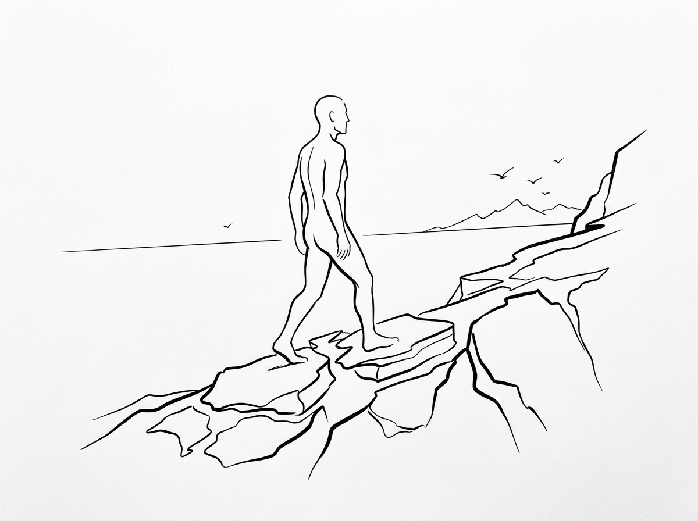

```text
┌──────────────────────────────────────────────────────────────────────────┐
│ [SUPERIMPOSED CARD OVERLAY]                                              │
│                                                                          │
│ THEME: BOUNDARY & DISCERNMENT                                            │
│                                                                          │
│                             GUARD THE GATES                              │
│                                                                          │
│ "Keep thy heart with all diligence; for out of it are the issues of life." │
│                             — Proverbs 4:23                              │
│                                                                          │
│ * Intent: What you tolerate at the gate will soon occupy the throne.     * │
└──────────────────────────────────────────────────────────────────────────┘
```

* **Visual Concept:** A resolute, calm figure stepping forward across rugged stone cliff ledges toward the open sea horizon, unbothered by the heights.
* **LoRA Master Prompt:** `jeff_sketch style, refined minimalist pen and ink master illustration of a resolute figure stepping forward across stone ledges towards an open horizon. Bold calligraphic black ink contour lines, pure stark white negative space, zero shading, zero hatching, zero gray tones, clean fine art print.`

### Dual Scripture Pairing
* **King James Version (KJV):** *"Keep thy heart with all diligence; for out of it are the issues of life."*
* **World English Bible (WEB):** *"Keep your heart with all diligence, for out of it follow the springs of life."*
* **Plain Language (2026):** *"Guard what enters your mind with extreme vigilance. The quality of your thoughts directly determines the quality of your entire life."*

### Extracted Intent
Vigilant cognitive boundary setting. Your attention is your most precious currency. Be ruthless about the media, gossip, and toxic narratives you allow to breach your mental walls.

### Daily Reflection Journal
1. *What inputs (digital media, conversations, environments) have been draining your mental energy or introducing cynicism into your heart this week?*

   _________________________________________________________________________________________________

   _________________________________________________________________________________________________

### Actionable Micro-Practice
* **Institute a 60-minute digital media fast today. Replace scrolling with 15 minutes of silent journaling or reading uplifting text.**

---

## Lesson 3: Surrender the Heavy Burden

> **Theme:** Relief & Humility · **Reference:** Matthew 11:28

### Visual Plate & Superimposed Concept
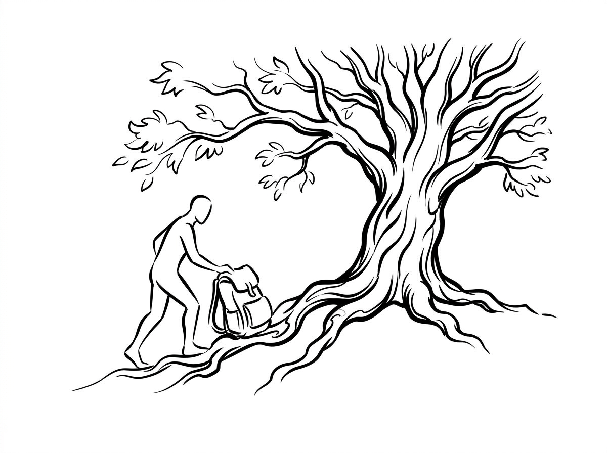

```text
┌──────────────────────────────────────────────────────────────────────────┐
│ [SUPERIMPOSED CARD OVERLAY]                                              │
│                                                                          │
│ THEME: SURRENDER & PEACE                                                 │
│                                                                          │
│                           LAY DOWN THE BURDEN                            │
│                                                                          │
│ "Come unto me, all ye that labour and are heavy laden, and I will give you rest." │
│                             — Matthew 11:28                              │
│                                                                          │
│ * Intent: Rest begins where your illusion of control ends.               * │
└──────────────────────────────────────────────────────────────────────────┘
```

* **Visual Concept:** A solitary traveler setting down a heavy worn leather pack beside the expansive roots of an ancient sheltering oak tree.
* **LoRA Master Prompt:** `jeff_sketch style, refined minimalist pen and ink master illustration of a solitary traveler setting down a heavy pack at the roots of an ancient oak tree. Bold calligraphic black ink contour lines, pure stark white negative space, zero shading, zero hatching, zero gray tones, clean fine art print.`

### Dual Scripture Pairing
* **King James Version (KJV):** *"Come unto me, all ye that labour and are heavy laden, and I will give you rest."*
* **World English Bible (WEB):** *"Come to me, all you who labor and are heavily burdened, and I will give you rest."*
* **Plain Language (2026):** *"You were never built to carry every outcome alone. Set down the exhausting burden of trying to control what isn't yours to fix."*

### Extracted Intent
Relinquishing exhausting hyper-independence and false control. Acknowledging limits is not defeat; it is the prerequisite for sustainable strength and peace.

### Daily Reflection Journal
1. *What specific burden are you currently carrying that belongs in God's hands rather than on your shoulders?*

   _________________________________________________________________________________________________

   _________________________________________________________________________________________________

### Actionable Micro-Practice
* **Write down the single heaviest worry on your mind today, then physically set the paper down and declare aloud: 'I release control of this outcome today.'**

---

## Lesson 4: Walk Through the Storm, Not Around It

> **Theme:** Endurance & Courage · **Reference:** Isaiah 43:2

### Visual Plate & Superimposed Concept
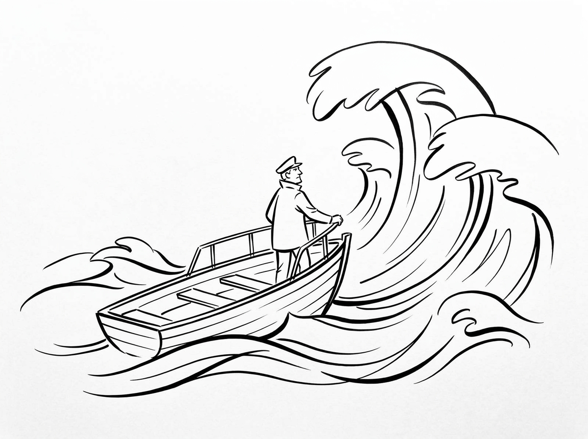

```text
┌──────────────────────────────────────────────────────────────────────────┐
│ [SUPERIMPOSED CARD OVERLAY]                                              │
│                                                                          │
│ THEME: COURAGE & RESILIENCE                                              │
│                                                                          │
│                            THROUGH THE WATERS                            │
│                                                                          │
│ "When thou passest through the waters, I will be with thee; and through the rivers, they shall not overflow thee." │
│                              — Isaiah 43:2                               │
│                                                                          │
│ * Intent: The current is strong, but your anchor is stronger.            * │
└──────────────────────────────────────────────────────────────────────────┘
```

* **Visual Concept:** A steady helmsman standing tall at the bow of a wooden skiff, steering calmly into towering, curling ocean waves.
* **LoRA Master Prompt:** `jeff_sketch style, refined minimalist pen and ink master illustration of a steady helmsman at the bow of a small boat facing curling ocean waves. Bold calligraphic black ink contour lines, pure stark white negative space, zero shading, zero hatching, zero gray tones, clean fine art print.`

### Dual Scripture Pairing
* **King James Version (KJV):** *"When thou passest through the waters, I will be with thee; and through the rivers, they shall not overflow thee."*
* **World English Bible (WEB):** *"When you pass through the waters, I will be with you; and through the rivers, they will not overflow you."*
* **Plain Language (2026):** *"When you must walk through deep and turbulent waters, you will not drown. You are not walking alone."*

### Extracted Intent
Facing adversity directly without escapism or denial. Hardship is not an error in your route; it is the forge where resilience and character are tempered.

### Daily Reflection Journal
1. *What hard conversation or challenging obstacle have you been trying to avoid? How would approaching it directly change your sense of self-respect?*

   _________________________________________________________________________________________________

   _________________________________________________________________________________________________

### Actionable Micro-Practice
* **Take one concrete action toward your most intimidating task today instead of postponing it to tomorrow.**

---

## Lesson 5: Anchor in What Cannot Be Shaken

> **Theme:** Identity & Stability · **Reference:** Psalm 46:1-2

### Visual Plate & Superimposed Concept
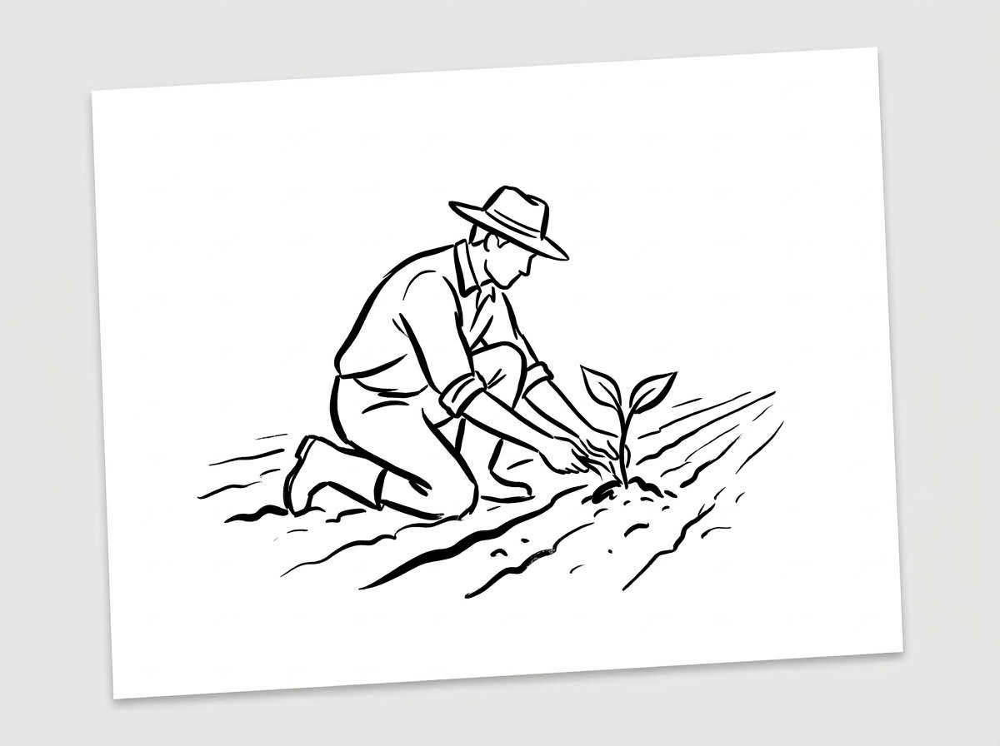

```text
┌──────────────────────────────────────────────────────────────────────────┐
│ [SUPERIMPOSED CARD OVERLAY]                                              │
│                                                                          │
│ THEME: STABILITY & REFUGE                                                │
│                                                                          │
│                           AN UNSHAKABLE REFUGE                           │
│                                                                          │
│ "God is our refuge and strength, a very present help in trouble. Therefore will not we fear." │
│                              — Psalm 46:1-2                              │
│                                                                          │
│ * Intent: When external circumstances shake, internal anchor holds.      * │
└──────────────────────────────────────────────────────────────────────────┘
```

* **Visual Concept:** A humble farmer kneeling in freshly furrowed soil, gently cupping and nurturing a single resilient green sprout.
* **LoRA Master Prompt:** `jeff_sketch style, refined minimalist pen and ink master illustration of a farmer kneeling in soil tending a small sprout. Bold calligraphic black ink contour lines, pure stark white negative space, zero shading, zero hatching, zero gray tones, clean fine art print.`

### Dual Scripture Pairing
* **King James Version (KJV):** *"God is our refuge and strength, a very present help in trouble. Therefore will not we fear, though the earth be removed."*
* **World English Bible (WEB):** *"God is our refuge and strength, a very present help in trouble. Therefore we won't be afraid, though the earth changes."*
* **Plain Language (2026):** *"When the ground beneath you seems to shift, your true foundation remains solid. You don't have to fear the shaking of the world."*

### Extracted Intent
Decoupling self-worth from transient outcomes. Build your foundation on eternal truth and steadfast character rather than social approval or shifting fortunes.

### Daily Reflection Journal
1. *When everything around you changes or fails to meet expectations, what principles or truths keep you rooted and calm?*

   _________________________________________________________________________________________________

   _________________________________________________________________________________________________

### Actionable Micro-Practice
* **Identify one area where you've sought validation from others, and recommit to judging your success solely by your effort, integrity, and faith.**

---

## Lesson 6: Prune What Drains Life to Bear Real Fruit

> **Theme:** Growth & Simplification · **Reference:** John 15:2

### Visual Plate & Superimposed Concept
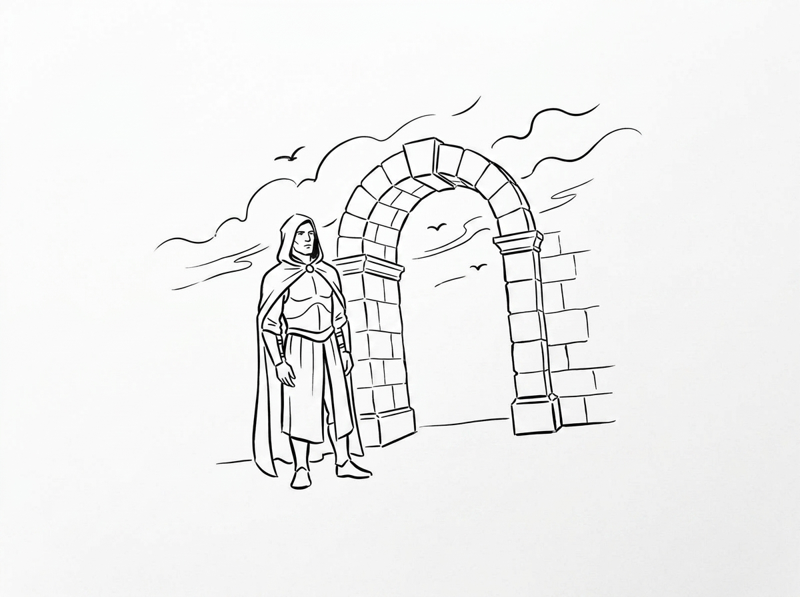

```text
┌──────────────────────────────────────────────────────────────────────────┐
│ [SUPERIMPOSED CARD OVERLAY]                                              │
│                                                                          │
│ THEME: SIMPLIFICATION & FOCUS                                            │
│                                                                          │
│                           PRUNED FOR ABUNDANCE                           │
│                                                                          │
│ "Every branch that beareth fruit, he purgeth it, that it may bring forth more fruit." │
│                               — John 15:2                                │
│                                                                          │
│ * Intent: Simplicity is not deprivation; it is focus.                    * │
└──────────────────────────────────────────────────────────────────────────┘
```

* **Visual Concept:** A calm, watchful guardian in a flowing cloak standing before an ancient stone masonry archway under open skies.
* **LoRA Master Prompt:** `jeff_sketch style, refined minimalist pen and ink master illustration of a calm watchful guardian standing at a stone gatehouse archway. Bold calligraphic black ink contour lines, pure stark white negative space, zero shading, zero hatching, zero gray tones, clean fine art print.`

### Dual Scripture Pairing
* **King James Version (KJV):** *"Every branch that beareth fruit, he purgeth it, that it may bring forth more fruit."*
* **World English Bible (WEB):** *"Every branch that bears fruit, he prunes, that it may bear more fruit."*
* **Plain Language (2026):** *"Pruning feels like cutting away good things, but it is the essential discipline that makes extraordinary growth possible."*

### Extracted Intent
Strategic elimination of the unnecessary. True growth requires pruning away habits, commitments, and relationships that sap vitality without producing real value.

### Daily Reflection Journal
1. *What good project or activity is currently cluttering your schedule and preventing you from focusing on your true calling?*

   _________________________________________________________________________________________________

   _________________________________________________________________________________________________

### Actionable Micro-Practice
* **Say 'no' to one non-essential demand or habit today to protect space for deep, meaningful work.**

---

## Lesson 7: Win the Battle One Day at a Time

> **Theme:** Presence & Daily Discipline · **Reference:** Matthew 6:34

### Visual Plate & Superimposed Concept
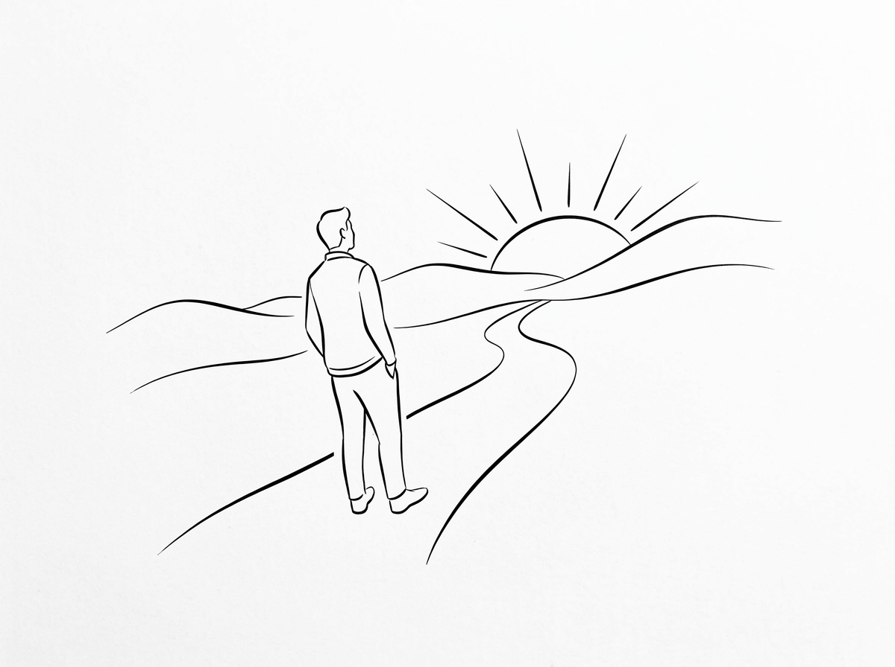

```text
┌──────────────────────────────────────────────────────────────────────────┐
│ [SUPERIMPOSED CARD OVERLAY]                                              │
│                                                                          │
│ THEME: PRESENCE & DISCIPLINE                                             │
│                                                                          │
│                            ONE STEP AT A TIME                            │
│                                                                          │
│ "Take therefore no thought for the morrow: for the morrow shall take thought for the things of itself." │
│                              — Matthew 6:34                              │
│                                                                          │
│ * Intent: Power lives in the present; anxiety lives in the future.       * │
└──────────────────────────────────────────────────────────────────────────┘
```

* **Visual Concept:** A solitary figure with hands in pockets walking a quiet winding path, looking out toward a brilliant morning sun rising over rolling hills.
* **LoRA Master Prompt:** `jeff_sketch style, refined minimalist pen and ink master illustration of a figure watching the morning sun rise over gentle hills along a quiet path. Bold calligraphic black ink contour lines, pure stark white negative space, zero shading, zero hatching, zero gray tones, clean fine art print.`

### Dual Scripture Pairing
* **King James Version (KJV):** *"Take therefore no thought for the morrow: for the morrow shall take thought for the things of itself. Sufficient unto the day is the evil thereof."*
* **World English Bible (WEB):** *"Therefore don't be anxious for tomorrow, for tomorrow will be anxious for itself. Each day has enough trouble of its own."*
* **Plain Language (2026):** *"Don't poison today by borrowing worries from tomorrow. Pour all your strength into the single step right in front of you."*

### Extracted Intent
Compartmentalization of anxiety into manageable 24-hour cycles. Chronic worry about tomorrow destroys your capacity to execute well today.

### Daily Reflection Journal
1. *Are you spending precious emotional energy trying to solve a problem that isn't scheduled to happen until weeks or months from now?*

   _________________________________________________________________________________________________

   _________________________________________________________________________________________________

### Actionable Micro-Practice
* **Write down only the top 3 critical priorities for today. Refuse to let future anxieties dictate your schedule today.**

---

## Lesson 8: Let Forgiveness Untie Your Chains

> **Theme:** Release & Healing · **Reference:** Colossians 3:13

### Visual Plate & Superimposed Concept
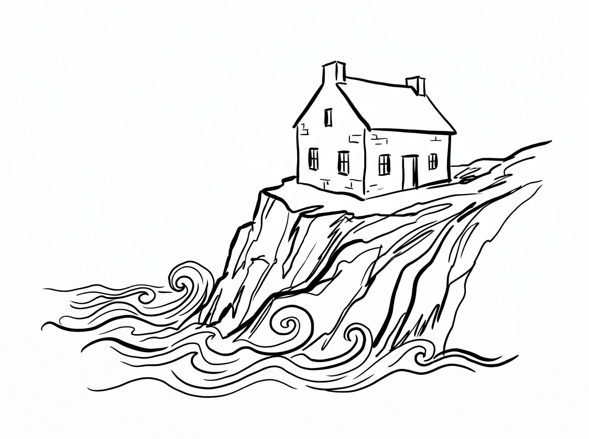

```text
┌──────────────────────────────────────────────────────────────────────────┐
│ [SUPERIMPOSED CARD OVERLAY]                                              │
│                                                                          │
│ THEME: FORGIVENESS & FREEDOM                                             │
│                                                                          │
│                          RELEASE THE GRIEVANCE                           │
│                                                                          │
│ "Forbearing one another, and forgiving one another... even as Christ forgave you, so also do ye." │
│                            — Colossians 3:13                             │
│                                                                          │
│ * Intent: Forgiveness unbinds the prisoner, and reveals the prisoner was you. * │
└──────────────────────────────────────────────────────────────────────────┘
```

* **Visual Concept:** A solid, steadfast stone house anchored firmly atop a steep granite bedrock cliff while turbulent ocean waves crash peacefully below.
* **LoRA Master Prompt:** `jeff_sketch style, refined minimalist pen and ink master illustration of a solid stone house built upon a high bedrock cliff above ocean waves. Bold calligraphic black ink contour lines, pure stark white negative space, zero shading, zero hatching, zero gray tones, clean fine art print.`

### Dual Scripture Pairing
* **King James Version (KJV):** *"Forbearing one another, and forgiving one another, if any man have a quarrel against any: even as Christ forgave you, so also do ye."*
* **World English Bible (WEB):** *"bearing with one another, and forgiving each other, if anyone has a complaint against any; even as Christ forgave you, so you also do."*
* **Plain Language (2026):** *"Release grudges immediately. Forgiveness is not about declaring wrong deeds right; it is about cutting the cord that binds your spirit to old wounds."*

### Extracted Intent
Release of toxic grievance and resentment. Holding bitterness gives the offender ongoing rent-free control over your peace. Forgiveness is your act of self-emancipation.

### Daily Reflection Journal
1. *Who is one person whose actions or words you still rehearse in your mind with anger? What would it feel like to permanently put down that grudge?*

   _________________________________________________________________________________________________

   _________________________________________________________________________________________________

### Actionable Micro-Practice
* **Silently offer a blessing or prayer for the well-being of someone you have resented, wishing them genuine peace.**

---

## Lesson 9: Serve in Secret, Build in Quiet

> **Theme:** Humility & Authenticity · **Reference:** Galatians 6:9

### Visual Plate & Superimposed Concept
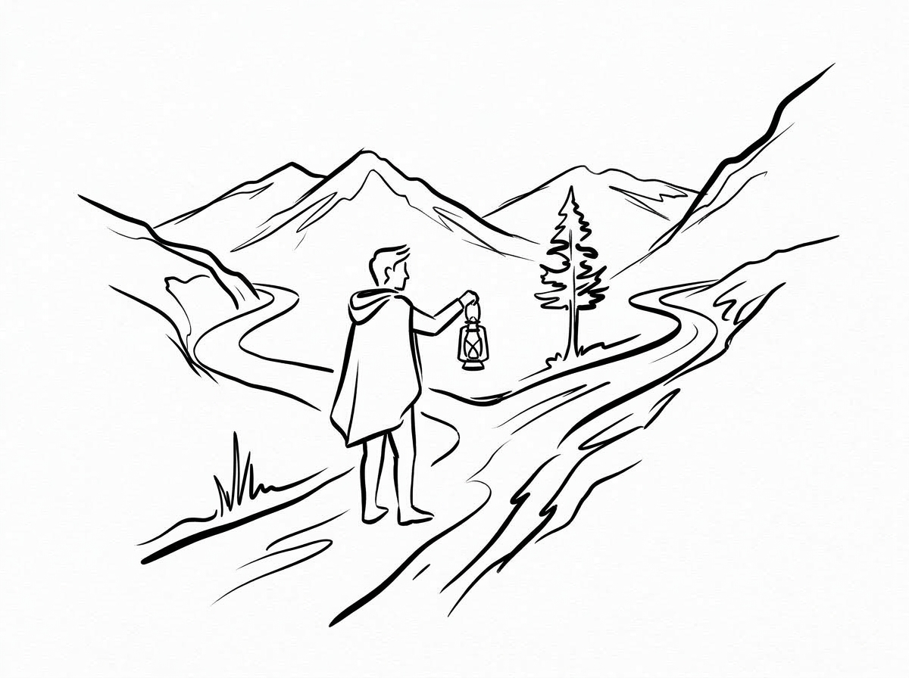

```text
┌──────────────────────────────────────────────────────────────────────────┐
│ [SUPERIMPOSED CARD OVERLAY]                                              │
│                                                                          │
│ THEME: HUMILITY & CONSISTENCY                                            │
│                                                                          │
│                            STEADFAST IN QUIET                            │
│                                                                          │
│ "And let us not be weary in well doing: for in due season we shall reap, if we faint not." │
│                             — Galatians 6:9                              │
│                                                                          │
│ * Intent: Quiet consistency outlasts noisy ambition every single time.   * │
└──────────────────────────────────────────────────────────────────────────┘
```

* **Visual Concept:** A solitary traveler holding an ancient lantern aloft at a fork in a mountain path, pausing in quiet wisdom before choosing the upward trail.
* **LoRA Master Prompt:** `jeff_sketch style, refined minimalist pen and ink master illustration of a traveler with a lantern at a fork in a mountain path. Bold calligraphic black ink contour lines, pure stark white negative space, zero shading, zero hatching, zero gray tones, clean fine art print.`

### Dual Scripture Pairing
* **King James Version (KJV):** *"And let us not be weary in well doing: for in due season we shall reap, if we faint not."*
* **World English Bible (WEB):** *"Let's not be weary in doing good, for we will reap in due season, if we don't give up."*
* **Plain Language (2026):** *"Never grow tired of doing honest, uncelebrated good. Consistent faithful action always bears fruit when the right season arrives."*

### Extracted Intent
Steadfast dedication without hunger for applause. Deep work, genuine kindness, and true character are forged in the quiet hours when nobody is cheering.

### Daily Reflection Journal
1. *What quiet habit or discipline have you felt tempted to abandon because you haven't seen immediate recognition or rapid results?*

   _________________________________________________________________________________________________

   _________________________________________________________________________________________________

### Actionable Micro-Practice
* **Perform one helpful act of service or contribution today completely anonymously, without telling anyone.**

---

## Lesson 10: Run Your Race with Eyes Fixed Forward

> **Theme:** Perseverance & Vision · **Reference:** Hebrews 12:1-2

### Visual Plate & Superimposed Concept
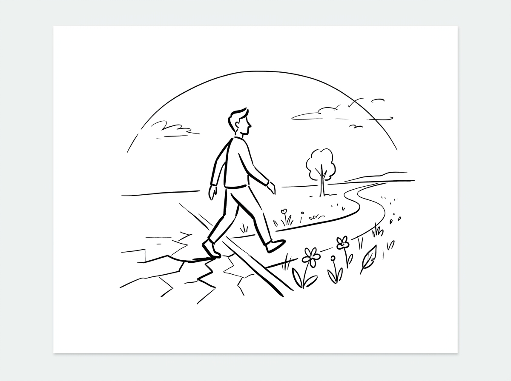

```text
┌──────────────────────────────────────────────────────────────────────────┐
│ [SUPERIMPOSED CARD OVERLAY]                                              │
│                                                                          │
│ THEME: PERSEVERANCE & VISION                                             │
│                                                                          │
│                            RUN WITH ENDURANCE                            │
│                                                                          │
│ "Let us run with patience the race that is set before us, Looking unto the author and finisher of our faith." │
│                             — Hebrews 12:1-2                             │
│                                                                          │
│ * Intent: Fix your eyes on the horizon; run your own lane.               * │
└──────────────────────────────────────────────────────────────────────────┘
```

* **Visual Concept:** A purposeful traveler stepping across a threshold line from dry, cracked desert ground onto a blossoming path winding through a vibrant open meadow.
* **LoRA Master Prompt:** `jeff_sketch style, refined minimalist pen and ink master illustration of a figure stepping across a threshold line from cracked barren earth onto a flowering meadow path. Flat 2D ink drawing on a pure stark white paper background, bold calligraphic black ink contour lines, vast negative space, zero 3D rendering, zero shading, zero gray tones, clean fine art print.`

### Dual Scripture Pairing
* **King James Version (KJV):** *"Let us run with patience the race that is set before us, Looking unto Jesus the author and finisher of our faith."*
* **World English Bible (WEB):** *"Let us run with perseverance the race that is set before us, looking to Jesus, the author and finisher of our faith."*
* **Plain Language (2026):** *"Cast off the distractions that trip you up, stop looking sideways at other runners, and run your own assigned course with steady, patient endurance."*

### Extracted Intent
Single-minded perseverance along your personal trajectory. Stop comparing your mile markers to others; focus wholly on your ultimate purpose with steady endurance.

### Daily Reflection Journal
1. *Where have you fallen into the trap of comparing your journey to someone else's timeline or accomplishments?*

   _________________________________________________________________________________________________

   _________________________________________________________________________________________________

### Actionable Micro-Practice
* **Define your single personal metric of success for the upcoming month, and disregard all external social comparisons.**

---

